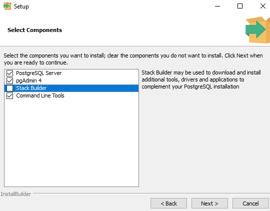

# SQL Data Engineering & Analysis
This repo creates a SQL database from six .csv files (data engineering) then answers questions about the data (data analysis) using: SQL, Python (SQLAlchemy, pandas, NumPy, and Matplotlib), pgAdmin 4, and PostgreSQL.


## **Getting Started**
#
**These instructions will get you a copy of the project up and running on your local machine for developement and testing purposes. See [Deployment](#Deployment "Goto **Deployment**") for notes on how to deploy the project on a live system.**


## **Prerequisites**
#
**What things you need to install the software and how to install them.**

* GitHub Account

* Python
    * Libraries: pandas, NumPy, matplotlib, and SQLAlchemy

* Git

* pgAdmin 4
  * *Additional information [here](https://www.pgadmin.org/).*

## **Installing**
#
**A step by step series of examples that tell you how to get a development environment running.**

*We are using Python and Jupyter Notebook so those two should be installed. I recommend using [Anaconda](https://docs.anaconda.com/anaconda/user-guide/index.html) and [Conda](https://docs.conda.io/projects/conda/en/latest/user-guide/) (both are free) to create a virtual environment if you currently don't have either one installed. Follow the instructions below to set these up on a PC. For additional information on Python Virtual Environments click [here](https://docs.python.org/3/tutorial/venv.html).*

**Python**
* Download and install [Anaconda](https://www.anaconda.com/products/individual)
    * Click download and select the latest Python version.
    * Open the installer and follow the instructions to complete the installation.
* Verify [Conda](https://docs.conda.io/projects/conda/en/latest/user-guide/) is installed by entering the following command into your terminal window:
```
conda --version
```
* Update Conda by running the following command into your terminal window:
```
conda update conda
```

* From your terminal run the following code to install [pip](https://pip.pypa.io/en/stable/):
```
conda install pip
```
* *pip is the package installer for Python. This will come in handy for the Python libraries we will be installing.*
    * *Python is infamous for its [libraries](https://en.wikipedia.org/wiki/Category:Python_(programming_language)_scientific_libraries).*

**Git**
* Download a free version control system called [Git](https://git-scm.com/).
    * *Git is a great way to interact with [GitHub](https://github.com/). You are currently viewing this repository on GitHub so I'm assuming you already have an account. If not, Sign up now.*

    * Go through the installation until you get to the "Choosing the default editor used by Git".
        * Select "Use Visual Studio Code as Git's default editor" if you don't already have a code editor installed. 
            * Download Visual Studio Code [here](https://code.visualstudio.com/).
    * Set up your user name in Git by following the instructions [here](https://docs.github.com/en/get-started/getting-started-with-git/setting-your-username-in-git).
    * Set up your user email address in Git by following the instructions [here](https://docs.github.com/en/github/setting-up-and-managing-your-github-user-account/managing-email-preferences/setting-your-commit-email-address).
    * Set up your SSH keys in Git by following the steps in this [video](https://www.youtube.com/watch?v=Nf2Ggt3Mwgk).

**Python Libraries**

*Click the library name for instructions on how to download.*
* [pandas](https://pandas.pydata.org/docs/getting_started/install.html)
* [NumPy](https://numpy.org/install/)  
* [matplotlib](https://matplotlib.org/stable/users/installing.html) 
* [SQLAlchemy](https://docs.sqlalchemy.org/en/14/intro.html#installation)


**Clone the repo**
1. In GitHub, in this repository (repo), Fork a copy of this repo by selecting "Fork".
    * For additional information click [here](https://docs.github.com/en/desktop/contributing-and-collaborating-using-github-desktop/adding-and-cloning-repositories/cloning-and-forking-repositories-from-github-desktop).
    
    * You should now have a Fork of this repo in your "Your repositories" on your GitHub account. 
2. In GitHub under "Your repositories, select the name of this repo.
    * Find the "Code" dropdown.
        * Select "SSH" and copy the entire line of code.
        *It should look similar to: "git@github.com:YourUserName/RepoName.git"*

3. Open A Git Bash terminal window where you would like to clone this repo.
    * *For now, you can open the terminal window on your desktop if you don't have another location in mind.*

4. Type the following code into your Git Bash terminal:
```
git clone
```

5. Paste the SSH key copied from step 2 after "git clone ", then press Enter.
    * *You should now have a clone of this repo on your local machine.* 

**Open Visual Studio Code**

1. Open your local copy of the repo in Visual Studio Code.

2. Create a new file in SQL-Data-Engineering-Analysis folder and "config.py"

3. In the config.py file, enter the following lines of code:
```
user = "postgres"
password = "<Your pgAdmin 4 password here>"
port = "5432"
host = "localhost"
database = "<Your database name here>"
```
4. Save these changes in Visual Studio Code.

5. Open a Git Bash terminal from your repo file and enter the following code:
```
git add .
```
Press Enter
```
git commit -m "<your meaningful note about what you did goes here>"
```
Press Enter
```
git push origin main
```
Press Enter

*You should now see the config.py file on your local repo copy on your computer but not on GitHub.*

**pgAdmin 4**

* *For Windows Operating System*
  * *The following installation instructions were created by Dominic LaBella for the Data Visualization and Analytics Boot Camp.*
* After downloading the latest version of PostgreSQL 11 [here](https://www.enterprisedb.com/downloads/postgres-postgresql-downloads), and reading the installation instructions [here](https://www.enterprisedb.com/docs/supported-open-source/postgresql/installer/), double click on the `postgresql-11.x-windows-x64.exe` file.

* **Note:** exact file version may be slightly different.

  

* Go through the Setup Wizard and install PostgreSQL. Keep the default location as: `/Library/PostgreSQL/11`.

* Select the components to be installed. **Un-check the option to install Stack Builder**.

  

* Next, add your Data Directory. Keep the default location as: `/Library/PostgreSQL/11/data`.

* Next, enter `postgres` as the password. **Be sure to record this password for future use.**

* Keep the default port as `5432` and in the Advanced Options, set locale as as `[Default locale]`.

* The final screen will be the `Pre Installation Summary`.

* When you are done, the `Postgres 11` folder can be accessed from the start menu of your computer.

  * This folder contains the `pgAdmin 4` application, which will be used throughout this unit.

  * To confirm the installation, start `pgAdmin` (this will open in a new browser window) and connect to the default server by clicking on it and entering the password if prompted.


## **Deployment**
#
**Data Modeling**

Inspect the CSVs and sketch out an ERD of the tables. Feel free to use a tool like [http://www.quickdatabasediagrams.com](http://www.quickdatabasediagrams.com).


**Data Engineering**

* Use the information you have to [create a table schema](tables.sql) for each of the six CSV files. Remember to specify data types, primary keys, foreign keys, and other constraints.

  * For the primary keys check to see if the column is unique, otherwise create a [composite key](https://en.wikipedia.org/wiki/Compound_key). Which takes to primary keys in order to uniquely identify a row.
  * Be sure to create tables in the correct order to handle foreign keys.

* Import each CSV file into the corresponding SQL table. **Note** be sure to import the data in the same order that the tables were created and account for the headers when importing to avoid errors.

**Data Analysis**

Once you have a complete database, do the following:
  * *See the Project Visuals below*

1. [List](#employee_details "Goto employee_details") the following details of each employee: employee number, last name, first name, sex, and salary.

2. [List](#unique_year_hires "Goto unique_year_hires") first name, last name, and hire date for employees who were hired in 1986.

3. [List](#manager "Goto manager") the manager of each department with the following information: department number, department name, the manager's employee number, last name, first name.

4. [List](#employee_dept "Goto employee_dept") the department of each employee with the following information: employee number, last name, first name, and department name.

5. [List](#hercules "Goto hercules") first name, last name, and sex for employees whose first name is "Hercules" and last names begin with "B."

6. [List](#employee_sales_dept "Goto employee_sales_dept") all employees in the Sales department, including their employee number, last name, first name, and department name.

7. [List](#sales_department "Goto sales_department") all employees in the Sales and Development departments, including their employee number, last name, first name, and department name.

8. In [decending order](#frequency_count "Goto frequency_count"), list the frequency count of employee last names, i.e., how many employees share each last name.


**Open Jupyter Notebook**

1. Open a Git Bash terminal from your repo file.

2. In your Git Bash terminal, type the following code: 
```
source activate PythonData
```
  * *(PythonData) should now be displayed in your Git Bash terminal.*

3. In your Git Bash terminal, type the following code: 
```
jupyter notebook
```
  * *You should now see a [Jupyter Notebook](sqlalchemy.ipynb) tab open in your web browser.*


# **Acknowledgments**
#
* I'd like to thank [Dominic LaBella](https://www.linkedin.com/in/dominiclabella/), my instructor at the Data Visualization and Analytics Boot Camp I attended, for planting a seed in my brain that was the start of my computer programming knowledge and understanding. I work hard every day to grow that seed. None of this would be possible for me if not for his passion for teaching and deep understanding of these subjects.

## **Project Visuals**
#
### employee_details

### unique_year_hires

### manager

### employee_dept

### hercules

### employee_sales_dept

### sales_department

### frequency_count


